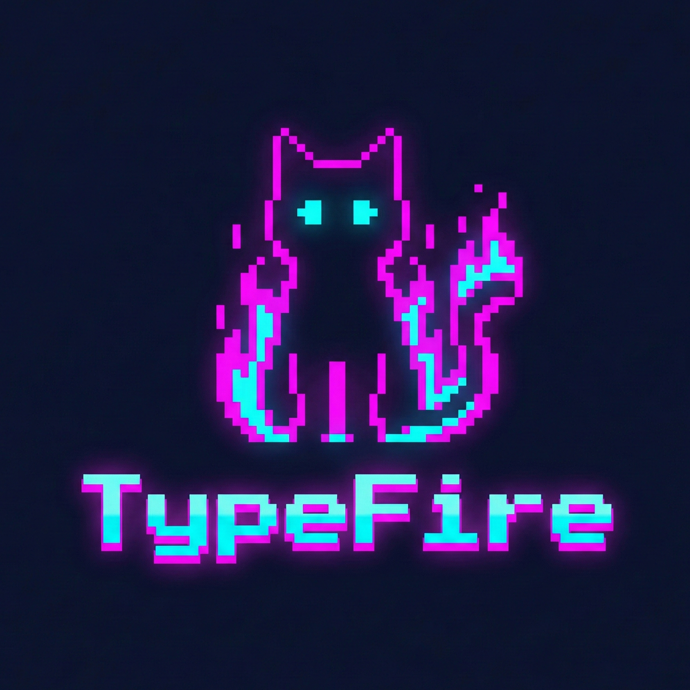

<div align="center">
  
  <h1>Ignite Type</h1>
  <p>
    A gamified typing trainer designed to improve speed and accuracy through an immersive, visual interface.
  </p>
  <br />
  
</div>

## Features

- **Multiple Typing Modes**: Practice with common words, full sentences, paragraphs, or code snippets.
- **Visual Keyboard**: Real-time finger placement guides to improve touch typing.
- **Dynamic Themes**: Choose from Cyberpunk, Glass, Pixel, Bento, and Retro styles.
- **Real-time Statistics**: Track WPM, accuracy, streak, and time as you type.
- **Companion System**: A virtual companion that levels up based on your performance.
- **Combo System**: Visual effects that intensify with your typing streak.
- **Sound Effects**: Audio feedback for keystrokes and errors.

## Discussion

This project explores the intersection of productivity tools and game design. The goal is to make the practice of typing less monotonous by adding progression systems and reactive visuals. Future updates may include custom text imports and leaderboard integration.

## Running Locally

1. Install dependencies:
   ```bash
   npm install
   ```

2. Run the development server:
   ```bash
   npm run dev
   ```

3. Build the desktop application:
   ```bash
   npm run tauri build
   ```
